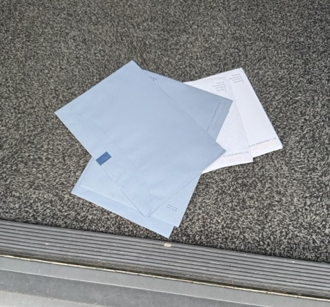
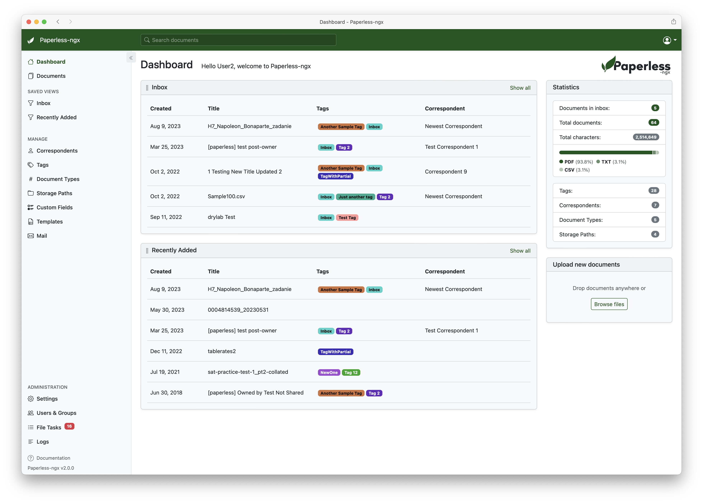
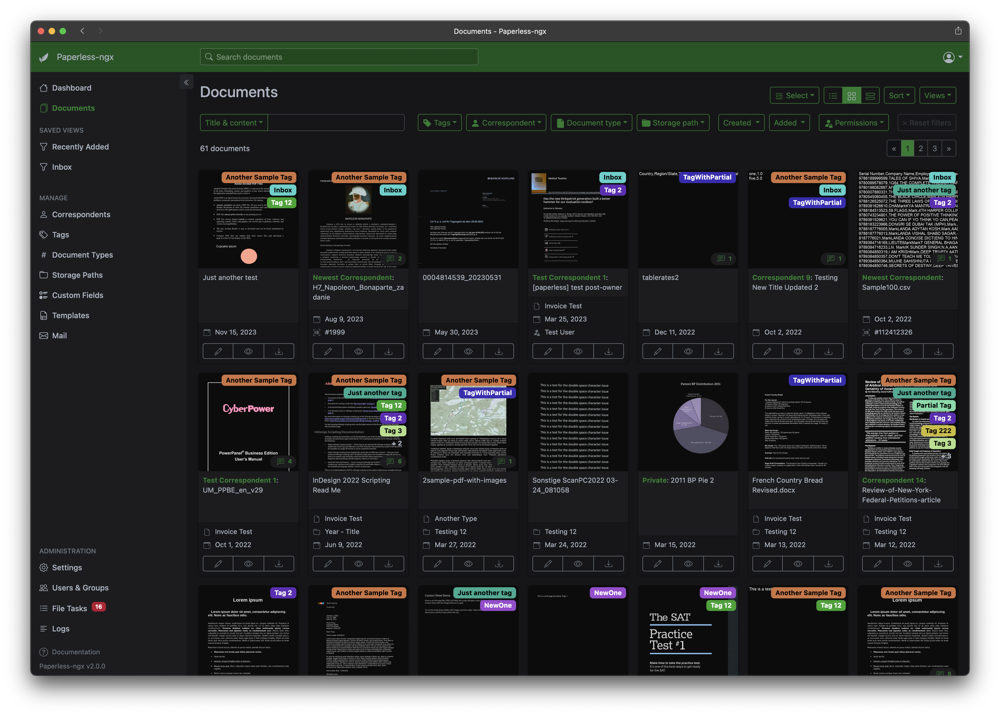
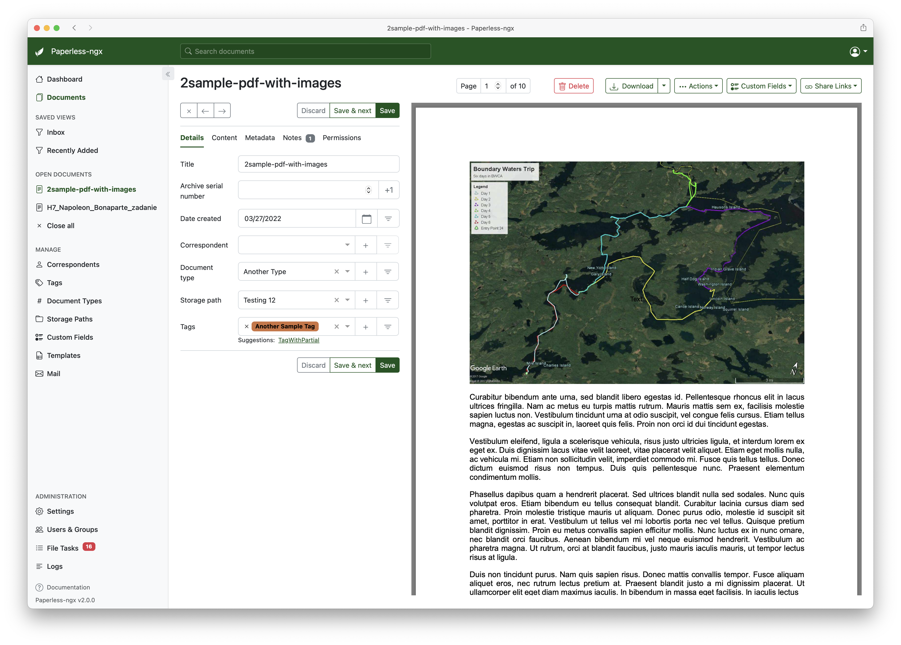
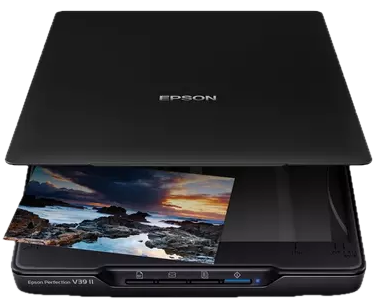
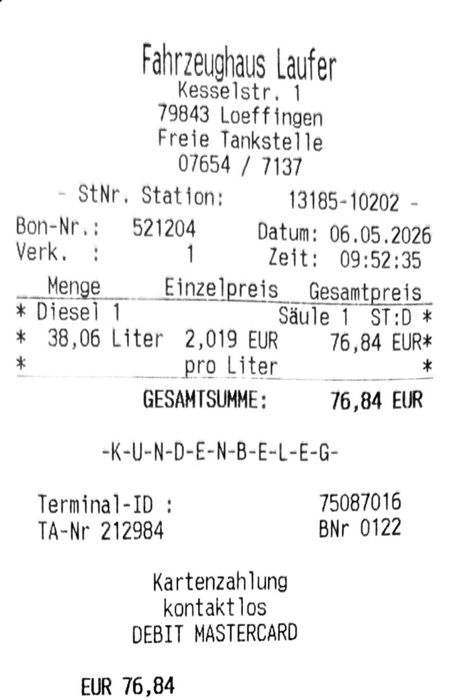
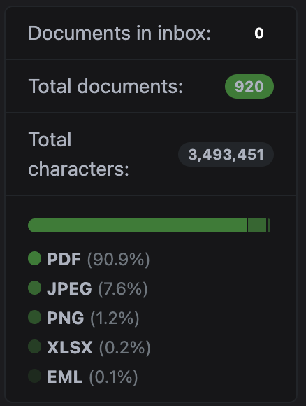

# How to store and route your (physical) mail like a pro

## personal edition

---

## How it all started

<!-- _class: lead -->



<!-- Intro into why this is the base for this story.
Having to deal with all the electronic mail, the physical mail and being able to find it when needed...

Especially with our friends of the blue envelopes, please proof what you did 5 years ago..

And what about our finance system, please provide all sources where your money came from and preferably where they got the money from 10 years ago
And please do this yearly, because we are forgetful.

-->

---

## Bart Dorlandt

- Freelance Network Automation Solution Architect
- 20 years in network engineering and automation
- Last year I presented "Repos are like children - Parenting 101"
- Lives by the phrase: *There must be a better way*
- https://linkedin.com/in/bartdorlandt/
- https://dreamnetworking.nl/

<div class="bottom-right">


</div>

<!-- I'll be talking you on a journey of on how to route and structure your mail -->
---

## Pragmatic approach to a better mail handling

- The problem: physical mail is a mess
- The goal: have a better way to handle it, store it, and find it
- The solution: a mail handling system that is flexible, automated, and easy to use

---

## Paperless-ngx

- I had heard about paperless-ngx, an open-source document management system
- I have a few friends that were already happy with it

---

## What is paperless-ngx

- A document management system that allows you to store, organize, and search your documents
- It has a web interface, an API, and can read and parse emails
- It can also watch folders for new documents to process
- It has features for self-improving, structuring & workflows

---



<!-- Mention:
Custom view
    Belastingdienst
    Invoices
    ...
-->
---




<!-- Mention:
Title
Correspondent
Document type
Storage path
tags -->

---



<!-- Mention:
Title
Correspondent
Document type
Storage path
tags -->

---

## Paperless-ngx

<div class="container">
<div class="col">

```yaml
services:
  broker:
    image: docker.io/library/redis:7
    restart: unless-stopped
    volumes:
      - redisdata:/data

  webserver:
    image: ghcr.io/paperless-ngx/paperless-ngx:latest
    restart: unless-stopped
    depends_on:
      - db
      - broker
      - gotenberg
      - tika
    ports:
      - "8078:8000"
    volumes:
      - data:/usr/src/paperless/data
      - /.../media:/usr/src/paperless/media
      - /.../export:/usr/src/paperless/export
      - /.../consume:/usr/src/paperless/consume
    env_file: docker-compose.env
    environment:
      PAPERLESS_REDIS: redis://broker:6379
      PAPERLESS_DBHOST: db
      PAPERLESS_TIKA_ENABLED: 1
      PAPERLESS_TIKA_GOTENBERG_ENDPOINT: http://gotenberg:3000
      PAPERLESS_TIKA_ENDPOINT: http://tika:9998
```

</div>
<div class="col">

```yaml
  db:
    image: docker.io/library/postgres:16
    restart: unless-stopped
    volumes:
      - pgdata:/var/lib/postgresql/data
    environment:
      POSTGRES_DB: paperless
      POSTGRES_USER: paperless
      POSTGRES_PASSWORD: "${POSTGRES_PASSWORD}"

  gotenberg:
    image: docker.io/gotenberg/gotenberg:8.7
    restart: unless-stopped

    # The gotenberg chromium route is used to convert .eml files. We do not
    # want to allow external content like tracking pixels or even javascript.
    command:
      - "gotenberg"
      - "--chromium-disable-javascript=true"
      - "--chromium-allow-list=file:///tmp/.*"

  tika:
    image: docker.io/apache/tika:latest
    restart: unless-stopped

volumes:
  data:
  pgdata:
  redisdata:
```
</div>
</div>

---
## Destinations

In my case:

- Paperless
- Bookkeeping system (email / app / web)
- Bookkeeper (email)

<!-- Both the bookkeeping system and the bookkeeper are reachable via email
I can now drop a document (incl image) in any of the systems

Some would already be happy with this, but not me...
-->

---

## Input



- I don't want to use this
- I "can't" use the camera app on the phone
  - doesn't work well in the dark
  - doesn't generate a pdf
- It should be easy!

---

## Dropbox camera

- It takes the picture and
  - enhances the contrast
  - finds the corners
  - generates a pdf
  - uploads it to the dropbox folder

> "NOTE: you'll have to accept this is synced to the cloud."



---

## Dependencies

- Synced folder
- Process the folder for new files
- Route the files to the right destination
  - ability to reach paperless and email
- Mark files as processed to avoid duplicates

---

## Where to host

- Synology NAS

---

## What do we need?

- CloudSync to sync the dropbox folder to the NAS
- Docker + docker-compose
- Python
- Scheduler

<!-- Comment on python
It ships with python2... ???
These days it has python3.9

But better, we have `uv` these days. Don't you just love uv?

Dependencies check
 -->

---

### Architecture of the glueware

- Ability to send to multiple destinations
- Ability to process folders for new files
- Ability to mark files as processed to avoid duplicates
- Ability to notify me in case of errors

---

## Fun things


<div class="container">
<div class="col">

```python

def main() -> None:
    """Main entry point for the script."""
    # Reading the vars here to ensure env dependencies are present and loaded
    paperless_vars = PaperlessVars(
        api_token=env.str("PAPERLESS_API_TOKEN"),
        api_path=env.str("PAPERLESS_API_PATH"),
        api_url=env.str("PAPERLESS_API_URL"),
    )
    bookkeeping_vars = EmailVars(
        to=env.str("BOOKKEEPING_EMAIL", validate=[validate.Length(min=4), validate.Email()]),
    )
    bookkeeper_vars = EmailVars(
        to=env.str("BOOKKEEPER_EMAIL", validate=[validate.Length(min=4), validate.Email()]),
    )
    ...

if __name__ == "__main__":
    MAIN_PATH = Path(env.str("PROCESS_FOLDER"))
    SMTP_VARS = SmtpVars(
        smtp_srv=env.str("SMTP_SRV"),
        smtp_usr=env.str("SMTP_USR", validate=[validate.Length(min=4), validate.Email()]),
        smtp_pwd=env.str("SMTP_PWD"),
        smtp_port=env.int("SMTP_PORT", default=465),
    )
    ERROR_EMAIL = env.str("ERROR_EMAIL", validate=[validate.Length(min=4), validate.Email()])
    FROM_EMAIL = env.str("SMTP_USR", validate=[validate.Length(min=4), validate.Email()])
    main()
```

</div>
<div class="col col-25">

```python
@dataclass
class SmtpVars:
    """Email (SMTP) configuration."""

    smtp_srv: str
    smtp_usr: str
    smtp_pwd: str
    smtp_port: int = 465

@dataclass
class PaperlessVars:
    """Paperless API configuration."""

    api_token: str
    api_path: str
    api_url: str

@dataclass
class EmailVars:
    """Email configuration."""

    to: str
```
</div>
</div>

---


```python
def main() -> None:
    ...
    paperless_processor = PaperlessAPIProcessor(paperless_vars)
    bookkeeping_processor = EmailProcessor(bookkeeping_vars)
    to_person_processor = EmailProcessor(bookkeeper_vars)

    logger.info("Loaded variables, processing directories...")
    process_folder(MAIN_PATH / "to_paperless", processors=[paperless_processor])
    process_folder(MAIN_PATH / "to_bookkeeping", processors=[bookkeeping_processor])
    process_folder(MAIN_PATH / "to_bookkeeping_paperless", processors=[paperless_processor, bookkeeping_processor])
    process_folder(MAIN_PATH / "to_paperless_bookkeeper", processors=[paperless_processor, to_person_processor])
    process_folder(MAIN_PATH / "to_bookkeeper", processors=[to_person_processor])
```
---
```python

def move_to_done(filepath: Path) -> None:
    """Move processed file to the done directory."""
    parent = filepath.parent.name
    done_dir = MAIN_PATH / "done" / parent
    done_dir.mkdir(parents=True, exist_ok=True)
    target = done_dir / filepath.name
    filepath.rename(target)
    logger.info(f"Moved {filepath} to {target}")


def process_folder(folder: Path, processors: list[FileProcessor]) -> None:
    """Process files in the given folder with the provided processors.
    Files starting with a dot are ignored.
    """
    folder.mkdir(exist_ok=True)
    for file in list(folder.iterdir()):
        if not file.is_file() or file.name.startswith("."):
            continue

        # Track if any processor succeeded
        processed = 0
        for processor in processors:
            # Only move to done if all processors succeed
            result = processor.process(file)
            processed += result
            if not result:
                error_email(subject="File Processing Error", filename=file.name)

        if processed == len(processors):
            move_to_done(file)
```
---

```python
from typing import Protocol

class FileProcessor(Protocol):
    """Protocol for file processors."""

    def process(self, filepath: Path) -> bool:
        """Process the file and return True if successful, False otherwise."""

```

---
```python
class PaperlessAPIProcessor:
    """Processor for uploading files to the Paperless API."""

    def __init__(self, vars: PaperlessVars) -> None:
        """Initialize with PaperlessVars."""
        self.vars = vars

    def process(self, filepath: Path) -> bool:
        """Process the file and upload it to the Paperless API."""
        url = f"{self.vars.api_url.rstrip('/')}{self.vars.api_path}"
        headers = {"Authorization": f"Token {self.vars.api_token}"}
        try:
            with filepath.open("rb") as f:
                response = requests.post(url, headers=headers, files={"document": f}, timeout=10)
        except requests.ConnectionError as e:
            logger.error(f"Failed to connect to Paperless API: {e}")
            return False
        except urllib3.exceptions.MaxRetryError as e:
            logger.error(f"Max retries exceeded while connecting to Paperless API: {e}")
            return False
        except urllib3.exceptions.NameResolutionError as e:
            logger.error(f"Name resolution error while connecting to Paperless API: {e}")
            return False
        logger.debug(f"Response from Paperless: {response.status_code} {response.text}")
        if response.status_code == 200:
            logger.info(f"Uploaded to Paperless: {filepath}")
            return True
        else:
            logger.error(f"Failed to upload {filepath} to Paperless: {response.status_code} {response.text}")
            return False
```

---
```python
class EmailProcessor:
    """Processor for sending files via email to bookkeeping."""

    def __init__(self, vars: EmailVars) -> None:
        """Initialize with EmailVars."""
        self.vars = vars

    def process(self, filepath: Path) -> bool:
        """Process the file and send it via email."""
        msg = new_email_message(
            subject=filepath.name,
            smtp_to=self.vars.to,
        )
        msg.set_content(f"Hi,\n\nPlease find attached the file: {filepath.name}.\n\nBest regards.")
        with filepath.open("rb") as f:
            msg.add_attachment(
                f.read(),
                maintype="application",
                subtype="octet-stream",
                filename=filepath.name,
            )
        try:
            send_email(msg=msg)
        except Exception as e:
            logger.error(f"Failed to send {filepath} via email: {e}")
            return False
        else:
            logger.info(f"Sent successfully via email: {filepath}")
            return True
```
---

## End result flow

1. Drop a pdf in the desired folder (phone / laptop)
2. It gets synced to dropbox and the NAS
3. Hourly the script runs and processes the files
4. When successful, the file is moved to the done folder

Once in a while I check the paperless inbox to process the docs

---
## Summary

- Having uv makes it incredibly easy to have a newer python version and manage dependencies (on a NAS)
- Your own playground allows you to experiment
  - Like `Protocol`
- Awesome that something this easy, saves me hours
  - The image snapping bit
  - Dropping attachments from email as well
  - but also finding documents

<!-- Did you need that receipt of your broken washing machine? -->

---

## What can you automate in your life?

**Q&A**

**Thank you.**

- Bart Dorlandt
- https://linkedin.com/in/bartdorlandt/

